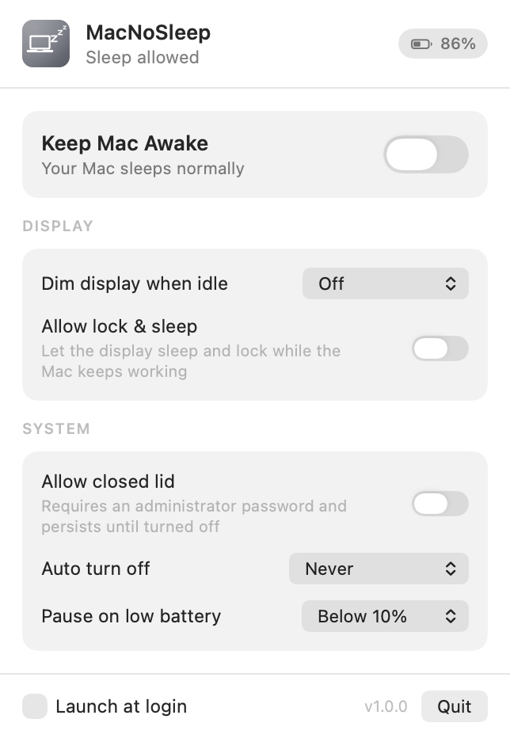
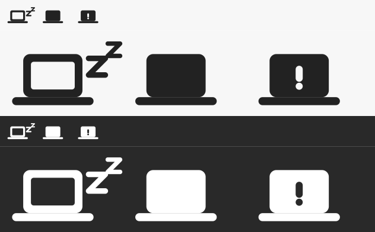

# MacNoSleep

A small macOS menu bar utility that stops your Mac from going to sleep while long-running work
finishes: builds, exports, downloads, presentations, remote sessions.

It lives entirely in the menu bar, has no dock icon and no preferences window.



## Features

| Feature | What it does |
| --- | --- |
| Keep Mac Awake | Holds IOKit power assertions so the system (and by default the display) stays on |
| Allow lock & sleep | Lets the display sleep and lock normally while the Mac keeps working |
| Dim display when idle | Drops the backlight after 1/5/15/30 minutes of no input, restores it on the next keypress |
| Dim level | Adjustable target brightness, 1–50% |
| Allow closed lid | Keeps a laptop running with the lid shut |
| Auto turn off | Ends the session automatically after 30 minutes up to 12 hours |
| Pause on low battery | Suspends the session when running on battery below 5/10/15/20% |
| Launch at login | Registers the app as a login item through `SMAppService` |

State is remembered across launches, so a Mac that was awake when you quit comes back awake.

## The status item

The menu bar glyph is a template image drawn in code, so it tints itself correctly for light, dark,
and highlighted menu bars. The laptop's screen carries the state:



| Glyph | Meaning |
| --- | --- |
| Hollow screen with rising "z"s | The Mac is free to sleep |
| Solid screen | A session is running |
| Warning mark | Paused because the battery is low |

## Requirements

- macOS 14 or later
- Xcode 15 or later (to build)

## Build

```bash
./build.sh            # universal (arm64 + x86_64), output in build/MacNoSleep.app
./build.sh --native   # current architecture only, faster
```

Then install it:

```bash
cp -R build/MacNoSleep.app /Applications/
open /Applications/MacNoSleep.app
```

Or download the notarised disk image from [macnosleep.com](https://macnosleep.com).

`build.sh` picks up the first "Developer ID Application" certificate in your keychain and signs
with the hardened runtime and a secure timestamp. If there isn't one it falls back to an ad-hoc
signature so the project still builds. Override the choice with:

```bash
MACNOSLEEP_SIGN_IDENTITY="Developer ID Application: Your Name (TEAMID)" ./build.sh
```

## Release

`release.sh` produces the artifact that ships on the website: it builds a signed universal app,
wraps it in a drag-to-install disk image, sends that image to Apple for notarisation, staples the
ticket so it verifies offline, and copies the result into `site/download/`.

```bash
./release.sh
```

It refuses to run against an ad-hoc signature. Notarisation credentials come from a `notarytool`
keychain profile, created once with:

```bash
xcrun notarytool store-credentials <profile-name> \
  --apple-id <apple-id> --team-id <team-id> --password <app-specific-password>
```

The profile name defaults to `text_polisher`, which is an existing profile on the author's machine
for the same Apple ID and team. Point it somewhere else with
`MACNOSLEEP_NOTARY_PROFILE=<profile-name>`. No secrets live in this repository; the credentials
stay in the login keychain.

## Website

[macnosleep.com](https://macnosleep.com) is a static landing page in `site/`, hosted on Cloudflare
Pages. It is plain HTML and CSS with no build step and no framework.

```bash
./site/build.sh    # regenerate icons, social card and product screenshots from the app
./site/deploy.sh   # publish to Cloudflare Pages
```

Every image on the page is generated from the app rather than mocked up: the icons and the social
card come from `IconArtwork`, and the screenshots are captured from the running UI.

## How it works

**Staying awake** uses two independent IOKit assertions, `PreventUserIdleSystemSleep` and
`PreventUserIdleDisplaySleep`. Keeping them separate is what makes "allow lock & sleep" possible:
the display assertion is dropped while the system assertion stays held. You can confirm what is
active at any time with `pmset -g assertions`.

**Dimming** is not covered by any public API. The app resolves `DisplayServicesSetBrightness` from
the private `DisplayServices` framework at runtime, falling back to `CoreDisplay` and then to the
legacy `IODisplayConnect` IOKit path for older Intel hardware. Idle time comes from
`CGEventSource.secondsSinceLastEventType`. The brightness in effect when dimming starts is saved
and restored on the next input event.

**Closed-lid operation** is the one feature that cannot be done from an unprivileged process. It
maps to the system-wide `SleepDisabled` power setting, so the app shells out to
`pmset -a disablesleep` behind an administrator prompt. Two consequences worth knowing:

- The setting is global and survives quitting and rebooting. MacNoSleep turns it back off when you
  quit, but if the app is force-killed the setting stays on until you disable it again (either from
  the menu or with `sudo pmset -a disablesleep 0`).
- Running a laptop with the lid closed and no external display blocks airflow. Prefer a stand or an
  external monitor for long sessions.

**Launch at login** uses `SMAppService.mainApp`. macOS ties the registration to the bundle's code
signature and location, so move the app to `/Applications` before enabling it. If macOS declines,
the app says so and points at System Settings › General › Login Items.

## Battery safety

When the Mac is on battery and drops to the configured floor, the session pauses: the assertions
are released and the menu bar icon changes to a warning. It resumes automatically once you plug in
or charge back above the threshold. The setting is hidden on desktops with no internal battery.

## Development

```bash
swift build                                  # debug build of the executable
./.build/debug/MacNoSleep --window out.png   # render the panel in a normal window and snapshot it
./.build/debug/MacNoSleep --menubar out.png  # contact sheet of the status item states
```

The `--window` flag exists because a `MenuBarExtra` panel is awkward to inspect while iterating on
layout. Passing a path makes the app write a PNG of the panel and exit.

The app icon is generated rather than checked in. `IconArtwork.swift` draws the mark — a MacBook
with rising "z"s — in Core Graphics, and it is shared by two callers: `Tools/GenerateIcon.swift`,
which `build.sh` compiles alongside it and pipes through `iconutil`, and the panel header, which
renders the same artwork tinted by whether a session is running. There is no way for the icon and
the in-app glyph to drift apart.

To try the crossed-out variants:

```bash
./build/generate-icon build/preview.iconset --strike marks   # strike through the "z"s
./build/generate-icon build/preview.iconset --strike full    # strike through everything
```

## Layout

```
Sources/MacNoSleep/
  MacNoSleepApp.swift     App entry point and termination cleanup
  AppState.swift          Settings, persistence, and the once-a-second evaluation loop
  MenuContentView.swift   The menu bar panel
  IconArtwork.swift       The MacBook-with-zzz mark, shared by the icon and the panel header
  MenuBarGlyph.swift      The template status item glyph and its three states
  PowerAssertions.swift   IOKit sleep assertions
  BrightnessControl.swift Backlight read/write across three backends
  BatteryMonitor.swift    Charge level and AC/battery state
  LidSleepControl.swift   pmset SleepDisabled via an authorisation prompt
  LaunchAtLogin.swift     SMAppService registration
  UserIdle.swift          Seconds since the last input event
  Settings.swift          Menu options and defaults keys
Tools/
  GenerateIcon.swift      App icon renderer
  GenerateSiteAssets.swift Favicons and social card for the website
Resources/Info.plist      Bundle metadata (LSUIElement, identifier, version)
build.sh                  Universal build, icon, bundle assembly, signing
release.sh                Disk image, notarisation, stapling, publish to site/
site/                     The macnosleep.com landing page
```

## Known limitations

- Dimming targets the main display only; external monitors are left alone.
- The private brightness APIs can change between macOS releases. If dimming stops working, the
  fallbacks in `BrightnessControl` are the place to look.
- There is no auto-update mechanism. New versions have to be downloaded from the site.

## Licence

MIT. See [LICENSE](LICENSE).
